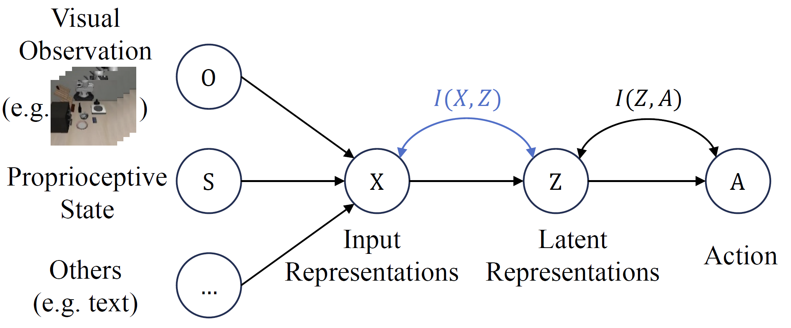

<div align="center">

#  Rethinking Latent Representations in Behavior Cloning: An Information Bottleneck Approach for Robot Manipulation

[](https://github.com/pre-commit/pre-commit)
[](https://pytorch.org/get-started/locally/)
[](https://pytorchlightning.ai/)
[](https://hydra.cc/)
[](https://github.com/ashleve/lightning-hydra-template#license)

[**Project Page**](https://baishuanghao.github.io/BC-IB.github.io/) | [**Paper**](https://raw.githubusercontent.com/baishuanghao/BC-IB/main/assets/BC-IB_paper.pdf) | [**arXiv**]()

[Shuanghao Bai](https://baishuanghao.github.io/), [Wanqi Zhou](https://ellezwq.github.io/), [Pengxiang Ding](https://dingpx.github.io/),  Wei Zhao, [Donglin Wang](https://milab.westlake.edu.cn/), [Badong Chen](https://gr.xjtu.edu.cn/web/chenbd/home).

</div>


## 🌟 Highlights

<div align="center">
  
</div>

> **<p align="justify"> Abstract:** *Behavior Cloning (BC) is a widely adopted visual imitation learning method in robot manipulation.
Current BC approaches often enhance generalization by leveraging large datasets and incorporating additional visual and textual modalities to capture more diverse information.
However, these methods overlook whether the learned representations contain redundant information and lack a solid theoretical foundation to guide the learning process.
To address these limitations, we adopt an information-theoretic perspective and introduce mutual information to quantify and mitigate redundancy in latent representations.
Building on this, we incorporate the Information Bottleneck (IB) principle into BC, which extends the idea of reducing redundancy by providing a structured framework for compressing irrelevant information while preserving task-relevant features.
This work presents the first comprehensive study on redundancy in latent representations across various methods, backbones, and experimental settings, while extending the generalizability of the IB to BC.
Extensive experiments and analyses on the CortexBench and LIBERO benchmarks demonstrate significant performance improvements with IB, underscoring the importance of reducing input data redundancy and highlighting its practical value for more practical applications.* </p>

<details>
  
<summary>Main Contributions</summary>

1) We extend the IB to BC and provide a comprehensive study on the impact of latent representation redundancy in BC for robot manipulation.
2) We empirically demonstrate that minimizing redundancy in latent representations helps existing BC algorithms significantly improve generalization performance on the Cortexbench and LIBERO benchmarks across various settings, indirectly highlighting the considerable redundancy present in current robot trajectory datasets.
3) We provide a detailed theoretical analysis explaining why IB enhances the transferability of BC methods.

</details>

## 🛠️ Installation

Refer to [INSTALL.md](documents/INSTALL.md) for installation instructions.

Check [ERROR_CATCH.md](documents/ERROR_CATCH.md) for troubleshooting steps based on the errors I personally encountered during installation.


## 💾 Data Preparation

Refer to [DOWNLOAD_DATASET.md](documents/DOWNLOAD_DATASET.md) for instructions on downloading datasets.


## 💻 Baseline Preparation

Refer to [DOWNLOAD_MODEL.md](documents/DOWNLOAD_MODEL.md) for instructions on downloading pre-trained models of basleines.


## 📈 Usage

Refer to [usage.md](documents/usage.md) for instructions on training and evaluation.


## 📨 Contact

If you have any questions, please create an issue on this repository or contact us at baishuanghao@stu.xjtu.edu.cn.


## 📝 Citation

If you find our work useful, please consider citing:
```
```


## 🙏 Acknowledgements

For LIBERO experiments, our code is primarily built upon the [LIBERO source code](https://github.com/Lifelong-Robot-Learning/LIBERO). The baseline implementations are mainly adapted from the LIBERO source code, while the environment is set up using [robosuite](https://github.com/ARISE-Initiative/robosuite).

For CortexBench experiments, our code is primarily based on the [eai-vc source code](https://github.com/facebookresearch/eai-vc). The baselines reference [ResNet](https://github.com/KaimingHe/deep-residual-networks), [ViT](https://github.com/google-research/vision_transformer), [R3M](https://github.com/facebookresearch/r3m), [MVP](https://github.com/ir413/mvp), [VC-1](https://github.com/facebookresearch/eai-vc), [Voltron](https://github.com/siddk/voltron-robotics), and [MPI](https://github.com/OpenDriveLab/MPI), while the environment setup is based on [CortexBench](https://github.com/facebookresearch/eai-vc), [dmc2gym](https://github.com/denisyarats/dmc2gym), [MetaWorld](https://github.com/Farama-Foundation/Metaworld), [trifinger_simulation](https://github.com/open-dynamic-robot-initiative/trifinger_simulation), [gym](https://github.com/openai/gym), and [MuJoCo](https://github.com/google-deepmind/mujoco).

